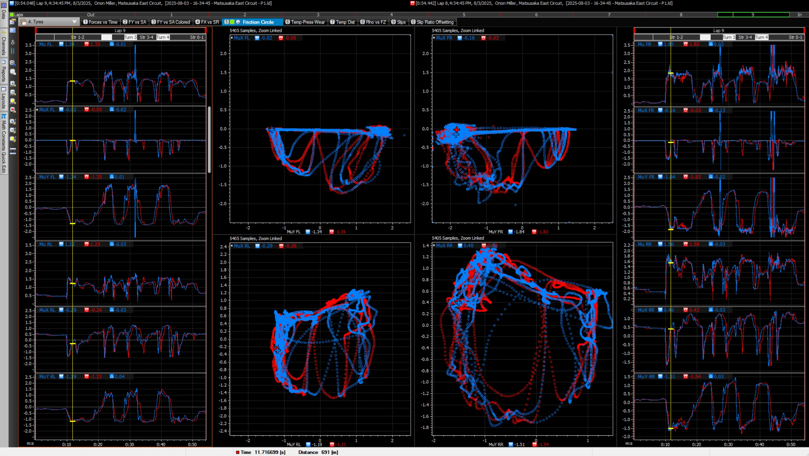
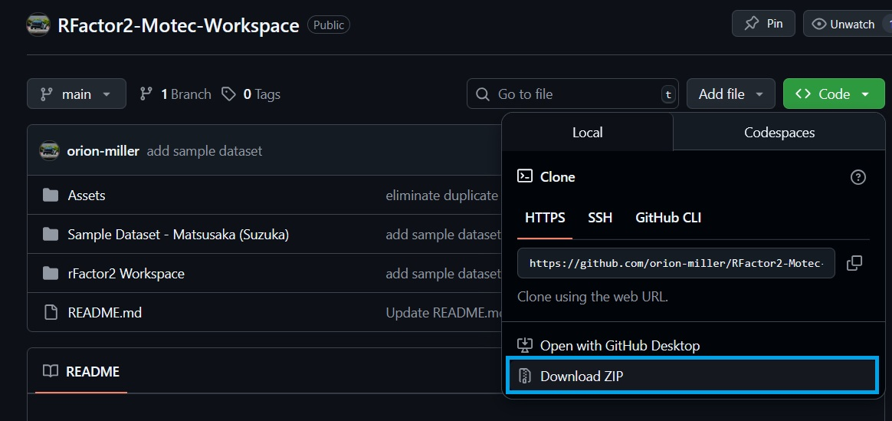
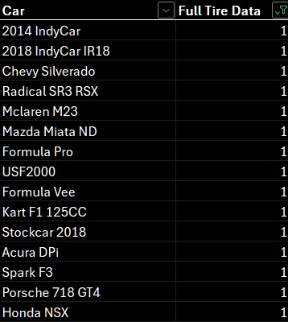
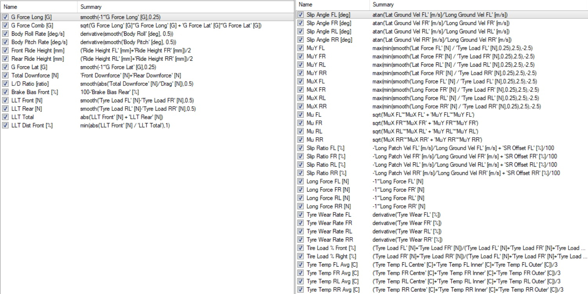

# rFactor2-Motec-Workspace



This is a template workspace for viewing vehicle telemetry data from rFactor 2 in Motec i2 Pro. It includes a range of helpful plots making use of most available data channels, and additional calculated math channels.

## Setup Steps

1. [Download Motec i2 Pro](https://www.motec.com.au/downloads)

2. Download this workspace:


3. Extract workspace, place somewhere convenient, and open in Motec i2 Pro

4. Set up [DAMPlugin](https://forum.studio-397.com/index.php?threads/damplugin-for-rf2.49363/) for rFactor 2 data logging

5. Configure data logging by overwriting the ```DAMPlugin.INI``` file with the one included here, or otherwise setting up as desired. This file controls channel groups to include, and at what resolutions.

You should now be able to log and view data. The sample dataset can be used as a reference to ensure your setup is working properly.

## Logged Channels

Once your DAMPlugin file is configured, population of all channels in this workbook still depends on the car being driven. Tire and/or aero channels are not populated for all cars, although there will still be plenty of useful info without them.

I've made a (non-comprehensive) list of cars that I have found to include full tire data output. 



Many cars do not output tire data due to confidentiality agreements for rFactor's partnerships with tire companies.

## Math Channels

Calculations are included for a range of math channels:


